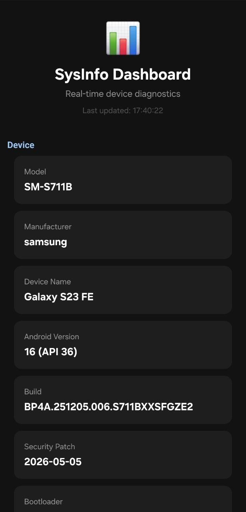

# SysInfo Dashboard

A real-time Android device diagnostics app. View your device's hardware, performance, battery, storage, display, network, and system information in a clean dark-themed dashboard.

## Screenshots

| Dark Theme Dashboard |
|:---:|
|  |
| *Dark theme with Material Design card-based layout showing device info, performance, battery, storage, display, and network* |

## Features

- 📊 **Device Info** — Model, manufacturer, Android version, security patch
- ⚡ **Performance** — CPU info, core count, RAM usage with live updates
- 💾 **Storage** — Internal storage usage breakdown
- 🔋 **Battery** — Level, health, temperature, charging status
- 🖥️ **Display** — Resolution, density, physical size
- 🌐 **Network** — Connection type and status
- 🔄 **Pull-to-refresh** — Swipe down to refresh all data
- ⏱️ **Auto-refresh** — Updates every 30 seconds

## Screenshots

| Dark Theme Dashboard |
|:---:|
| *Material Design 3 dark theme with card-based layout* |

## Download

Download the latest APK from the [Releases](https://github.com/samsungs6wanker69/DeviceInfo/releases) page.

## Building from Source

```bash
git clone https://github.com/samsungs6wanker69/DeviceInfo.git
cd DeviceInfo
./gradlew assembleRelease
```

The APK will be at `app/build/outputs/apk/release/app-arm64-v8a-release.apk`.

## Requirements

- Android 8.0 (API 26) or higher
- ARM64 device

## License

MIT License — see [LICENSE](LICENSE).
